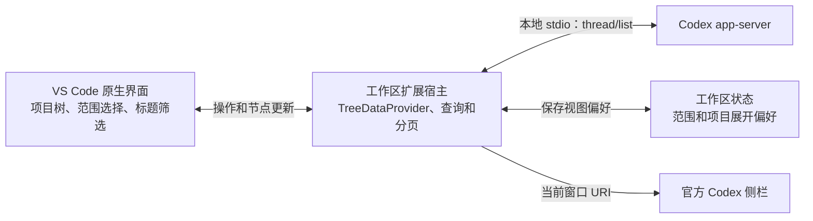

# Codex Chats List 架构

```mermaid
flowchart LR
  UI["VS Code 原生界面<br/>项目树、范围选择、标题筛选"]
  Host["工作区扩展宿主<br/>TreeDataProvider、查询和分页"]
  Server["Codex app-server"]
  Codex["官方 Codex 侧栏"]
  Prefs["工作区状态<br/>范围和项目展开偏好"]
  UI <-->|"操作和节点更新"| Host
  Host <-->|"本地 stdio：thread/list"| Server
  Host <-->|"保存视图偏好"| Prefs
  Host -->|"当前窗口 URI"| Codex
```

宿主从本地 app-server 读取会话元数据，按工作目录分组，再更新树节点。展开项目时从宿主缓存取子节点。只有可见的树会启动后台轮询和相对时间更新。

查询、视图行为与持久状态的说明见 [DESIGN.md](DESIGN.md)。
